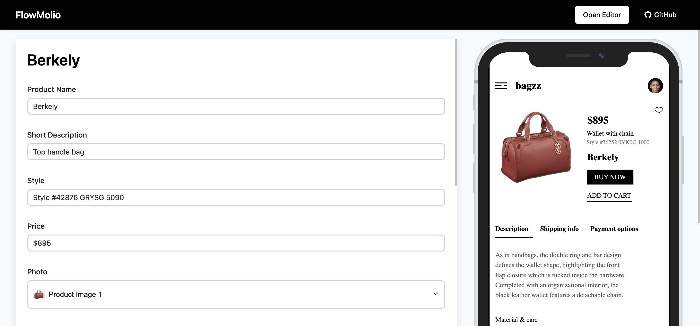

# FlowMolio Sample

An interactive product content demo showcasing the [FlowMolio](https://github.com/vladvlasov256/flowmolio) functionality.



## About

This is a live preview of content managed through a product information system. The preview is designed in Figma and connected to the API with FlowMolio.

Visit [FlowMolio](https://flowmol.io/) to create your own interactive previews!

## Getting Started

To run this project locally:

1. Install dependencies:
```
yarn install
```

2. Start the development server:
```
yarn start
```

The app will open in your browser at [http://localhost:3000](http://localhost:3000).

## Credits

The mobile preview design is based on the following Figma mockup:

- **Author**: Vijay Gupta
- **Resource**: Bagzz - Shopping app UI kit
- **License**: Licensed under CC BY 4.0
- **Link**: [Figma Community File](https://www.figma.com/community/file/883316722778883740)

